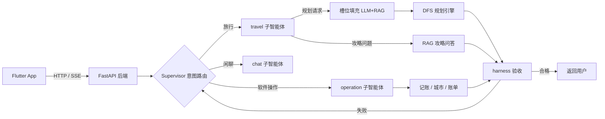

<div align="center">

[简体中文](README.md) · [English](README.en)

<br/>


[](https://www.apache.org/licenses/LICENSE-2.0)

</div>

---

# 迹录 Tracord

**旅行记录 + 行程规划 + 知识攻略三合一的移动端应用**

在地图上点亮去过的城市、一句话记账；AI 助手听懂一句"上海去杭州玩4天，预算3000"，
直接生成**可执行**的时间轴行程单——几点坐什么车、在哪吃饭、住哪、每项花多少钱。

---

## 目录

- [功能特性](#功能特性)
- [系统架构](#系统架构)
- [技术栈](#技术栈)
- [项目结构](#项目结构)
- [环境要求](#环境要求)
- [快速开始](#快速开始)
  - [1. 配置后端](#1-配置后端)
  - [2. 初始化数据库](#2-初始化数据库)
  - [3. 启动两个本地模型服务](#3-启动两个本地模型服务)
  - [4. 构建向量数据库](#4-构建向量数据库)
  - [5. 启动后端](#5-启动后端)
  - [6. 启动前端](#6-启动前端)
- [真机调试](#真机调试usb-连接手机)
- [使用指南](#使用指南)
- [微调自己的模型](#微调自己的模型)
- [配置项说明](#配置项说明)
- [常见问题 FAQ](#常见问题-faq)
- [数据说明](#数据说明)
- [License](#license)

---

## 功能特性

### 🗺️ 地图点亮足迹
- 全国城市边界 GeoJSON（后台 isolate 解析）+ 射线法命中检测
- 长按城市即可点亮 / 取消点亮 / 去规划 / 去记录，点亮的城市渲染为高亮多边形
- 点亮自动建立旅行档案，账单、笔记、行程按城市归档

### 🧭 AI 行程规划
- 小模型槽位填充：一句话提取出发地 / 目的地 / 天数 / 预算（RAG 少样本示例增强）
- 确定性 DFS 规划引擎：时间驱动状态机 + 回溯剪枝 + 动态预算拆分，
  基于真实景点 / 车次 / 航班数据规划，杜绝大模型"编车次、算错账"
- 输出按天分组的时间轴行程卡片：交通 / 餐饮 / 住宿 / 景点 + 逐项费用 + 超支预警

### 💬 智能记账
- 自然语言一句话记账："北京住宿200" 自动归类入账
- 按城市查账单明细、消费统计与预算对照

### 📚 攻略问答
- 本地攻略知识库向量检索回答，支持 txt / pdf / csv 文档导入，按文件增量更新

### 🛡️ 对话稳定（Harness 架构）
- 确定性 Python 代码对模型输出验收重试：合格直出、失败摘除子智能体重开对话
- 0.8B 小模型也能提供较为出色的对话服务

## 系统架构



一次规划请求的完整链路：

```
用户: "上海去杭州玩4天，预算3000"
  → supervisor 选 travel 子智能体
  → 槽位填充: {出发:上海, 目的:杭州, 天数:4, 预算:3000}
  → DFS 引擎: (去程×回程×酒店) 组合搜索 + 按天填槽
  → 返回时间轴行程卡片
```

## 技术栈

| 层 | 技术 |
|---|---|
| 前端 | Flutter 3.x + Provider + dio + flutter_map（天地图）+ GeoJSON |
| 后端 | FastAPI + SQLAlchemy 2.0(async) + MySQL 8.x + Redis + Alembic |
| 智能体 | LangChain + LangGraph，多智能体 supervisor |
| 规划引擎 | 自研 DFS + 回溯剪枝 + 动态预算拆分 |
| RAG | Chroma + m3e embedding |
| 模型 | Qwen3.5-0.8B LoRA 微调（LLaMA-Factory）+ llama.cpp 本地推理 |

## 项目结构

```
tracord/
├── backend/                        # FastAPI 后端
│   ├── main.py                     # 应用入口(uvicorn main:app)
│   ├── alembic/                    # 数据库迁移
│   ├── app/
│   │   ├── routers/                # 接口层(user/cities/trips/bills/agent...)
│   │   ├── services/               # 业务服务层
│   │   ├── crud/                   # 数据访问层
│   │   ├── models/                 # ORM 模型
│   │   ├── config/                 # 数据库/邮箱/JWT 配置(读 .env)
│   │   ├── core/                   # token/邮件等核心工具
│   │   ├── data/                   # 运行时数据缓存
│   │   └── agent/                  # AI 多智能体
│   │       ├── tracord_agent.py    # supervisor + harness 主循环
│   │       ├── config/             # yml 配置(模型/向量库/提示词)
│   │       ├── prompts/            # 各角色提示词
│   │       ├── data/               # 槽位示例 + 攻略文档(china_city_guide.txt)
│   │       ├── model/              # 模型工厂(llama.cpp 接入)
│   │       ├── chat/               # 闲聊子智能体
│   │       └── travel/             # 旅行子智能体
│   │           ├── services/       # 规划引擎(planner_engine)/RAG/槽位填充
│   │           ├── tools/          # travel_plan / rag 工具
│   │           └── data_source/    # 高德/12306/RollingGo 数据源
│   ├── operation/                  # 软件操作子智能体
│   ├── train_data/                 # 微调训练数据(tool_calling_train.jsonl)
│   ├── scripts/                    # 工具脚本(向量库构建/微调数据生成/回归测试)
│   └── docs/                       # 工程文档
├── frontend/                       # Flutter 前端
│   └── lib/features/               # map / agent / trips / plans / records / auth...
```

## 环境要求

| 依赖 | 版本 | 用途 |
|------|------|------|
| Python | 3.12+ | 后端运行 |
| [uv](https://docs.astral.sh/uv/) | 最新 | Python 依赖管理 |
| MySQL | 8.x | 业务数据库 |
| Redis | 6+ | 验证码冷却 / 缓存 |
| Flutter | 3.x | 移动端 |
| Android SDK | 含 adb | 真机调试 |
| [llama.cpp](https://github.com/ggml-org/llama.cpp) | 最新 | 本地模型推理 |
| 微调后的对话模型 | Qwen3.5-0.8B GGUF | 端口 8080 |
| [m3e-small](https://huggingface.co/moka-ai/m3e-small) 向量模型 GGUF | - | 端口 8081 |

## 快速开始

> 以下命令默认在项目根目录执行，涉及后端的先 `cd backend`。

### 1. 配置后端

```bash
cd backend
uv sync
cp .env.example .env    # 将内置占位符换成个人的
```

全部配置项说明见 [配置项说明](#配置项说明)。

### 2. 初始化数据库

MySQL 中创建 `tracord` 库（字符集 utf8mb4），然后执行迁移：

```bash
alembic upgrade head
```

### 3. 启动两个本地模型服务

程序依赖**两个**本地模型服务，缺一不可：

```bash
# 终端 1: 对话模型(端口 8080) — 负责槽位填充、意图路由、对话生成
llama-server -m qwen3.5-0.8b.gguf --port 8080

# 终端 2: 向量模型(端口 8081) — 负责攻略/槽位示例的向量化, 必须带 --embedding
llama-server -m m3e-small.gguf --port 8081 --embedding
```

模型与端口的对应关系配置在 `backend/app/agent/config/model.yml`。

### 4. 构建向量数据库

首次运行前必须构建，否则攻略问答和槽位填充没有素材：

```bash
# ① 灌入槽位填充的少样本示例
python scripts/_load_slots.py

# ② 灌入攻略文档(backend/app/agent/data/ 下的 txt/pdf/csv)
python -c "from app.agent.travel.services.vector_store import VectorStoreService; VectorStoreService().load_document()"
```

- 向量库生成在 `backend/chroma_db/`，支持增量更新（按文件 md5 去重），重复执行安全
- 扩充攻略知识库：往 `backend/app/agent/data/` 新增 `.txt`（按城市组织）或 `.pdf`/`.csv`，
  再次进行操作 ② 即可

### 5. 启动后端

```bash
uvicorn main:app --host 127.0.0.1 --port 8000
```

启动日志应能看到数据库连接成功、无报错。

### 6. 启动前端

```bash
cd frontend
flutter pub get
flutter run
```

## 真机调试（USB 连接手机）

1. 手机开启 USB 调试，数据线连接电脑（首次连接需在手机上确认授权）
2. 执行端口转发，把手机的 8000 端口映射到电脑（adb 在 Android SDK 的 `platform-tools` 目录）：

```bash
D:\Android\SDK\platform-tools\adb.exe reverse tcp:8000 tcp:8000
```

3. 前端 `lib/core/network/api_config.dart` 的 baseUrl 保持 `http://127.0.0.1:8000` 即可

> ⚠️ 每次重新插拔数据线 / 重启 adb 后，需要**重新执行**一遍 adb reverse。
>
> 局域网调试：后端加 `--host 0.0.0.0` 启动，
> baseUrl 改成 `http://你电脑的局域网IP:8000`，手机与电脑连接同一 Wi-Fi。

## 模拟器调试

Android 模拟器中 baseUrl 使用 `http://10.0.2.2:8000`（10.0.2.2 是模拟器访问宿主机的专用地址）。

## 使用指南

### 规划一次旅行
对 AI 助手说："上海去杭州玩4天，预算3000" → 生成 4 天时间轴行程卡片，
包含每天几点坐哪趟车、在哪吃饭、住哪家酒店、逐项费用与总花费、超支预警。

### 记一笔账
旅行中说一句："南宁住宿200" → 自动记账归类；随时问"我在南宁花了多少"查账单。

### 点亮城市
去过某地后，在地图长按该城市 → 点亮 → 自动建立旅行档案，
账单/笔记/行程按城市归档，点亮的城市在地图上高亮。

## 微调自己的模型

本项目的前端交互与提示词体系可以配合任何基座模型复现微调：

1. 训练数据：`backend/train_data/tool_calling_train.jsonl`
   （可用 `backend/scripts/gen_finetune_data.py` 追加生成样本，注意先阅读脚本顶部说明）
2. 使用 [LLaMA-Factory](https://github.com/hiyouga/LLaMA-Factory) 对 Qwen3.5-0.8B
   做 LoRA 微调（数据格式：LLaMA-Factory 的 sharegpt/tool-calling 格式）
3. 训练完成后合并 LoRA 权重并导出 GGUF，交给 llama.cpp 部署（见第 3 步）
4. 替换后建议跑 `backend/scripts/batch_test_budget.py` 做回归验证

## 配置项说明

`backend/.env` 全部配置项：

| 配置项 | 说明 | 示例 |
|--------|------|------|
| AMAP_KEY | 高德开放平台 key（POI 数据拉取） | - |
| ROLLINGGO_KEY | RollingGo 平台 key（交通数据拉取） | - |
| TIANDITU_KEYS | 天地图 key，逗号分隔可填多个（地图瓦片） | key1,key2 |
| MAIL_USERNAME | 发验证码的 QQ 邮箱 | xxx@qq.com |
| MAIL_PASSWORD | QQ 邮箱 SMTP 授权码（非登录密码） | 16位授权码 |
| MAIL_FROM | 发件邮箱（同 MAIL_USERNAME） | xxx@qq.com |
| MAIL_PORT | SMTP 端口（QQ SSL 固定 465） | 465 |
| MAIL_SERVER | SMTP 服务器 | smtp.qq.com |
| MAIL_SSL / MAIL_STARTTLS | 加密方式 | True / False |
| JWT_SECRET_KEY | 登录令牌签名密钥，建议 32 字节以上随机串 | `python -c "import secrets; print(secrets.token_urlsafe(48))"` |
| DB_USER / DB_PASSWORD | MySQL 账号密码 | root / xxx |
| DB_HOST / DB_PORT | MySQL 地址 | localhost / 3306 |
| DB_NAME | 数据库名 | tracord |

模型与向量库配置在 `backend/app/agent/config/` 下的 yml 文件
（model.yml / chroma.yml / prompts.yml），一般无需改动。

## 常见问题 FAQ

<details>
<summary><b>登录报 500 / 验证码收不到？</b></summary>

依次检查：MySQL 是否启动、`tracord` 库是否已建、`alembic upgrade head` 是否执行、
`.env` 里邮箱配置是否正确（QQ 邮箱使用 SMTP **授权码**而非登录密码，
需在 QQ 邮箱设置 → 账户 → 开启 SMTP 服务后生成）。
</details>

<details>
<summary><b>攻略问答 / 槽位提取没反应？</b></summary>

8081 端口的 m3e 向量模型服务没启动，或者第 4 步"构建向量数据库"没执行。
确认 `backend/chroma_db/` 目录已生成、两个模型服务都在运行。
</details>

<summary><b>模型连接报错 / 502？</b></summary>

确认 8080 / 8081 两个 llama.cpp 服务都在运行；Windows 下若使用 httpx 直连出现 502，
本项目已内置 RequestsTransport 绕过（见 `backend/app/agent/model/factory.py`）。
</details>

<details>
<summary><b>真机连不上后端 / 一直超时？</b></summary>

USB 方式：确认 adb reverse 已执行且设备已授权（`adb devices` 能看到设备），
重新插拔数据线后需重新执行 reverse。
局域网方式：后端需以 `--host 0.0.0.0` 启动，手机与电脑同一 Wi-Fi，防火墙放行 8000 端口。
</details>

<details>
<summary><b>规划结果提示"无法规划"或超预算？</b></summary>

预算过低会触发预算剪枝导致无解（引擎允许 20% 浮动），可适当提高预算；
另请查看后端日志确认景点/餐厅/交通数据是否拉取成功（API key 是否有效）。
</details>

<details>
<summary><b>地图不显示瓦片？</b></summary>

天地图 key（TIANDITU_KEYS）未配置或额度用尽；key 在 .env 中逗号分隔可填多个轮询。
</details>

## 数据说明

本仓库**不包含任何业务数据**。首次运行时，程序会用你在 `.env` 里配置的
高德 / 12306 / RollingGo key 自动拉取景点、餐厅、交通数据，
并缓存到本地 `backend/app/data/`（该目录已被 .gitignore 排除，不会被提交）。

数据来自第三方服务，请遵守其服务条款，拉取到的数据请勿直接再分发。

## License

本项目采用 [Apache License 2.0](https://www.apache.org/licenses/LICENSE-2.0)，详见 [LICENSE](LICENSE)。

分发时请保留版权声明与许可声明；使用第三方 API 拉取的数据请遵守数据源服务条款。

## 致谢

- [llama.cpp](https://github.com/ggml-org/llama.cpp) — 本地大模型推理
- [LLaMA-Factory](https://github.com/hiyouga/LLaMA-Factory) — 模型微调
- [LangChain](https://github.com/langchain-ai/langchain) / [LangGraph](https://github.com/langchain-ai/langgraph) — 智能体框架
- [Flutter](https://flutter.dev) / [flutter_map](https://github.com/jaffaketchup/flutter_map) — 移动端与地图
- [Chroma](https://github.com/chroma-core/chroma) — 向量数据库
